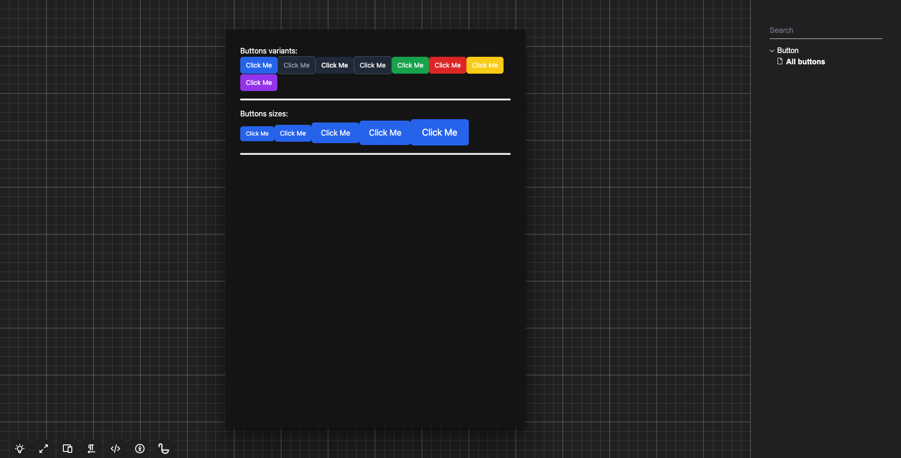
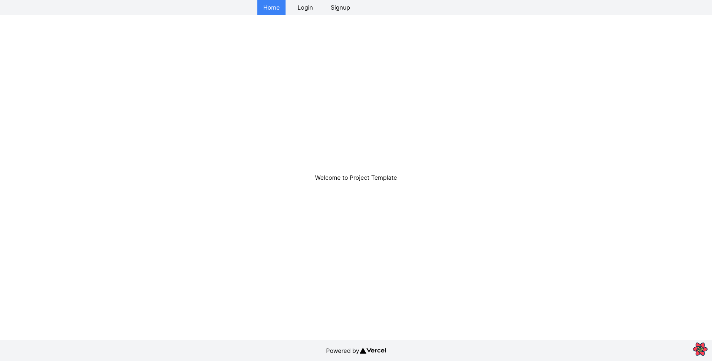

# pnpm monorepo template with Next.js, Tailwind CSS, Turbo and Ladle

In this [pnpm](https://pnpm.io/) monorepo template, you will find:

- Sharable ESLint package. You can apply specific rules per project.
- Sharable TSConfig package with an example for JSX/React/Next.js.
- Sharable Tailwind CSS package used by UI and Design System
- Using [Ladle](https://ladle.dev/) for Design System, an alternative for Storybook.
- `web` project with Next.js, Tailwind CSS and React-Query

## Ladle

## Web

